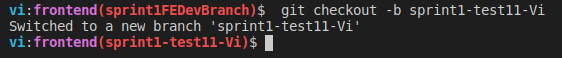
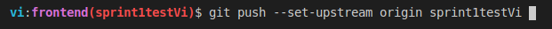
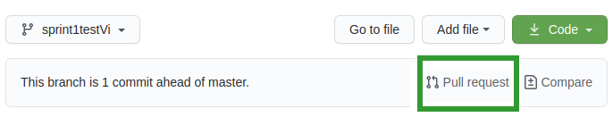
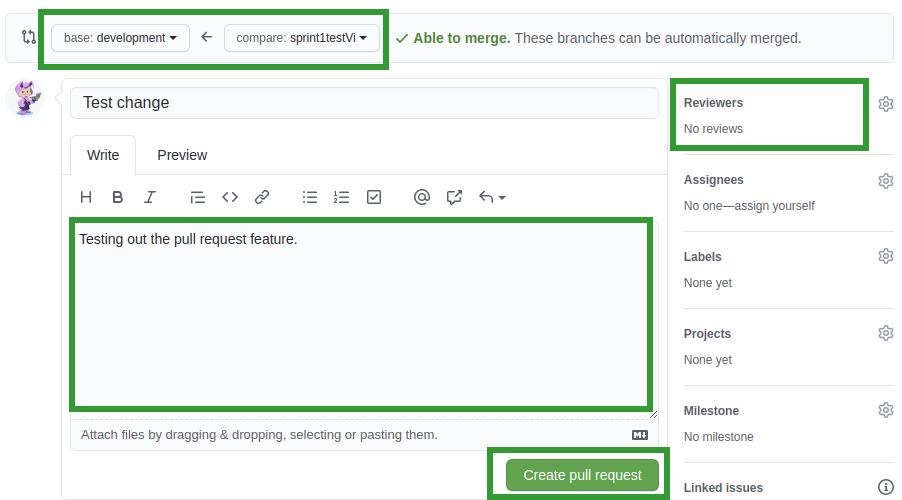

# Front-end application 

 - Basic starter template
 - React application created using [Create React App](https://github.com/facebook/create-react-app).  

## Additionaly installed packages

 - react-router-dom
 - axios

## Requirements

 - Docker needs to be installed on your machine.
 - See [here](https://docs.docker.com/engine/install/) to find the download instructions that best fit your operating system.

## Steps to run the application

 - In the terminal, navigate to the frontend directory in the project.

 - Running `docker-compose up` will install all the dependencies and run the application

 -  Open [http://localhost:3000](http://localhost:3000) to view it in the browser.  
    
    
## To add features

 - Ensure that the current branch is the **development** branch
 - Create a new branch for your feature
 - To use axios, just import axios into the component  
 `import axios from 'axios';`  
- We are ready to add features!

## Git workflow using the terminal

1. Clone the repo
  - Ensure you are **on the dev branch** and **in the frontend directory**  

2. Create a new branch for your feature  
  
    `git checkout -b <branchname>`  

    

3. Push your feature branch up.  

	`git push --set-upstream origin <branchname>`

    

	**NOTE:** Use this command only the first time you are pushing the feature branch up. For the other times `git push` will suffice. Just ensure you are in the feature branch when running `git push`

4. Make changes in your feature branch only.

5. Commit changes often.

	To stage changes-  `git add .`
	To commit changes- `git commit . -m "<message>"`

6. When the feature is ready, push changes up.  

    `git push`

5. On the repo, initiate a pull request.

    

6. On the Pull request screen:
  - Tag @Rita and I. You will see us in the Reviewers section on the right.
  - Leave a comment explaining the changes.
  - Press the 'Create pull request'  button

    
